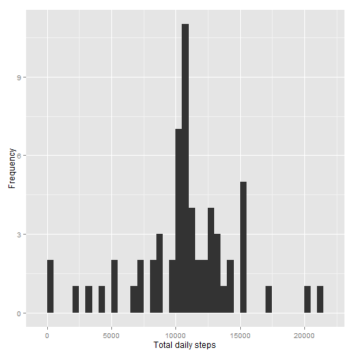

# Reproducible Research: Peer Assessment 1


## Loading and preprocessing the data

Load required packages and data


```r
library(plyr)
```

```
## Warning: package 'plyr' was built under R version 3.0.3
```

```r
library(ggplot2)
```

```
## Warning: package 'ggplot2' was built under R version 3.0.3
```

```r
data<-read.csv("C:/Users/Beth/Desktop/Reproducible_research/activity.csv",
               colClasses=c(NA,"Date",NA))
data<-data.frame(data)
```

## What is mean total number of steps taken per day?

**Ignore missing data**  
Histogram, mean and median statistics for total steps per day

```r
data_byday<-ddply(data,.(date),summarise,
sum=sum(steps,na.rm=TRUE))
qplot(sum,data=data_byday,geom="histogram",binwidth=500,xlab="Total daily steps",ylab="Frequency")
```

 

```r
round(mean(data_byday$sum),0)
```

```
## [1] 9354
```

```r
round(median(data_byday$sum),0)
```

```
## [1] 10395
```

## What is the average daily activity pattern?

Daily activity pattern 
- Histogram of mean daily steps by 5 minute interval
- Interval with maximum steps

```r
data_byinterval<-ddply(data,.(interval),summarise,
mean=mean(steps,na.rm=TRUE))
qplot(interval,mean,data=data_byinterval,geom="line",xlab="Interval",ylab="Mean steps in interval")
```

 

```r
data_byinterval$interval[which(max(data_byinterval$mean)==data_byinterval$mean)]
```

```
## [1] 835
```

## Imputing missing values

**Address missing data**  
Imputation process
- identify number of missing data intervals
- impute value using interval mean
- compare daily totals (histogram, mean, median)

```r
sum(is.na(data$steps))
```

```
## [1] 2304
```

```r
data_imputation<-join(data,data_byinterval)
```

```
## Joining by: interval
```

```r
data_imputation$steps[is.na(data_imputation$steps)]<-
  data_imputation$mean[is.na(data_imputation$steps)]

data_byday_imputation<-ddply(data_imputation,.(date),summarise,
sum=sum(steps,na.rm=TRUE))
qplot(sum,data=data_byday_imputation,geom="histogram",binwidth=500,xlab="Total daily steps",ylab="Frequency")
```

 

```r
round(mean(data_byday_imputation$sum),0)
```

```
## [1] 10766
```

```r
round(median(data_byday_imputation$sum),0)
```

```
## [1] 10766
```

These results show that when data is imputed there are fewer days with zero steps  
This increases the mean and median number of daily steps


## Are there differences in activity patterns between weekdays and weekends?


Compare weekends and weekdays


```r
data_imputation$weekend<-weekdays(data_imputation$date)%in%c("Saturday","Sunday")
data_imputation$weekend[data_imputation$weekend==TRUE]<-"weekend"
data_imputation$weekend[data_imputation$weekend==FALSE]<-"weekday"
data_byinterval_imputation<-ddply(data_imputation,.(interval,weekend),summarise,
mean=mean(steps))
qplot(interval,mean,data=data_byinterval_imputation,geom="line",xlab="Interval",ylab="Mean  steps in interval",facets=weekend~.)
```

 
